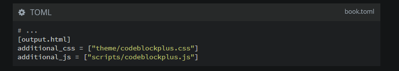

# Code Block Plus: Improved code blocks for mdBook




````markdown,filepath=src/some_chapter.md,icon=fa-markdown
```html,filepath=path/to/file.html,icon=fa-html5,lang=MEGAHTML,hidelines=%
%<html>
%<body>
<p>hi</p>
%</body>
%</html>
```
````

[See the result in the book](https://phoenixr-codes.github.io/mdbook-code-block-plus).

